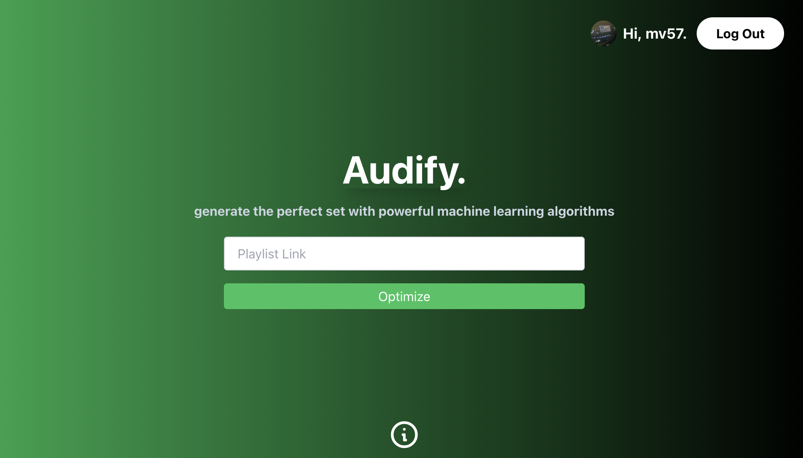
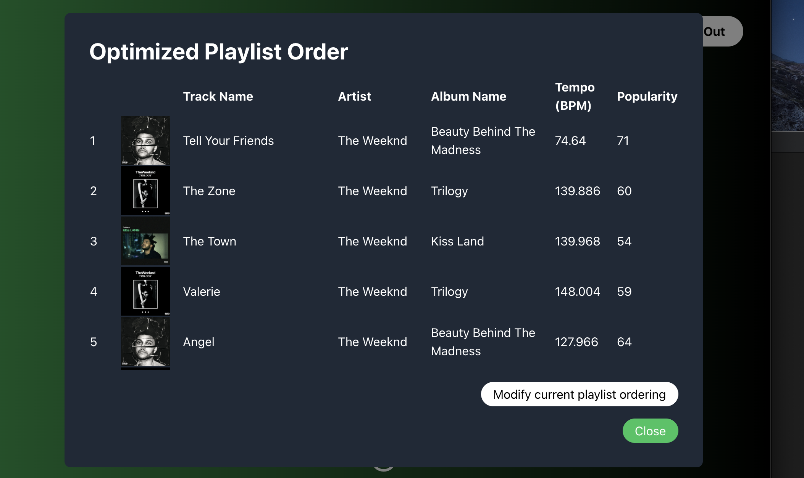
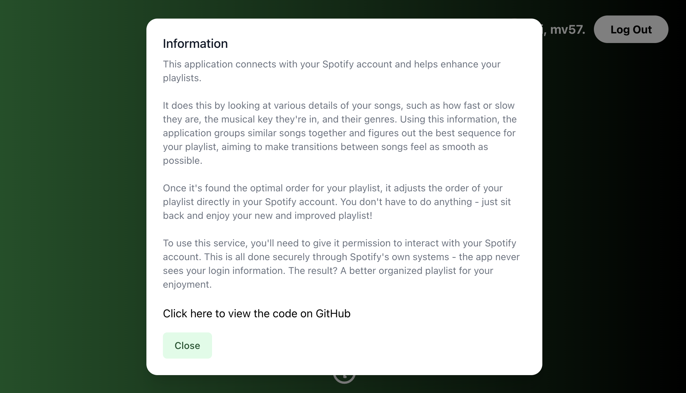

# Audify

Audify is a web application that optimizes Spotify playlists by minimizing the transition cost between songs. The transition cost is calculated based on the difference in various audio features of the songs. The application utilizes the Spotify API to fetch information about the songs and their audio features. This README provides an overview of the application, instructions to set it up, and details about its key components.

## Key Features

- Optimizes Spotify playlists for a seamless listening experience.
- Considers attributes like key compatibility, genre similarity, danceability, energy, loudness, tempo, and valence.
- Retrieves song data and audio features using the Spotify API.
- Implements a custom clustering algorithm to group songs based on their transition cost.
- Supports reordering of the original playlist based on the optimized order.

## Getting started

### Prerequisites:
Node.js and npm (Node Package Manager)
Python 3.7 or higher

To start using the app:

1. Clone the repository to your local machine: git clone <repository-url>
2. Navigate to the project directory: cd audify
3. Install the frontend dependencies: npm install
4. Start the frontend by simply running 'npm start'
5. Start the backend by running 'python server.py'

## How does it work?

Audify is built using React for the frontend and Flask for the backend. The frontend provides a user interface to input the Spotify playlist link, while the backend handles the optimization process and interacts with the Spotify API.
  
## Frontend Components
- LoadingOverlay: Displays a loading overlay while the playlist is being optimized.
- SpotifyAuth: Handles Spotify authentication and provides login/logout functionality.
- OptimizedPlaylist: Shows the optimized playlist with song details and offers the option to reorder the original playlist.
- ErrorDialog: Displays an error message if any error occurs during the optimization process.
- PlaylistForm: Renders the form to input the Spotify playlist link.

## Backend Components
- get_all_playlist_tracks(uri): Retrieves all tracks in a Spotify playlist given its URI.
- get_song_data(track_id): Fetches the track information and audio features for a given track ID using the Spotify API.
- get_related_artist_genres(artist_id): Gets the genres of related artists for a given artist ID.
- get_relative_key(key, mode): Calculates the relative major or minor key given the current key and mode.
- key_compatibility(key1, mode1, key2, mode2): Checks if two keys are compatible based on their relative major or minor keys.
- genre_similarity(genres1, genres2): Calculates the genre similarity between two songs based on the number of shared genres.
- evaluate_transition(song1, song2): Calculates the transition cost between two songs based on various attributes.
- custom_distance(song1, song2): Calculates the custom distance between two songs using the evaluate_transition function.
- custom_clustering_algorithm(songs, n_clusters): Applies a custom clustering algorithm to group songs based on their transition cost.
- reorder_playlist(): Handles the endpoint to reorder the original playlist based on the optimized order.
- optimize_playlist(): Handles the endpoint to optimize a Spotify playlist by minimizing the transition cost between songs.

## Usage
- Open Audify in your web browser by visiting http://localhost:3000.
- Click on the "Login with Spotify" button to authorize Audify to access your Spotify account.
- Input the link to the Spotify playlist you want to optimize in the provided form and click the "Optimize Playlist" button.

Audify will start optimizing the playlist by calculating the transition cost between songs and clustering them accordingly. Once the optimization is complete, Audify will display the optimized playlist with song details and the option to reorder the original playlist.
To reorder the original playlist, click the "Reorder Playlist" button, and Audify will update the order of songs in your Spotify playlist.

Enjoy your optimized playlist with minimized transition costs for a seamless listening experience!

Contributions are welcome! If you have any ideas, improvements, or bug fixes, please submit a pull request or open an issue on GitHub.

### Acknowledgements
This project was inspired by the desire to create a better listening experience by optimizing the order of songs in a playlist.
The application utilizes the Spotify API to fetch song information and audio features.

